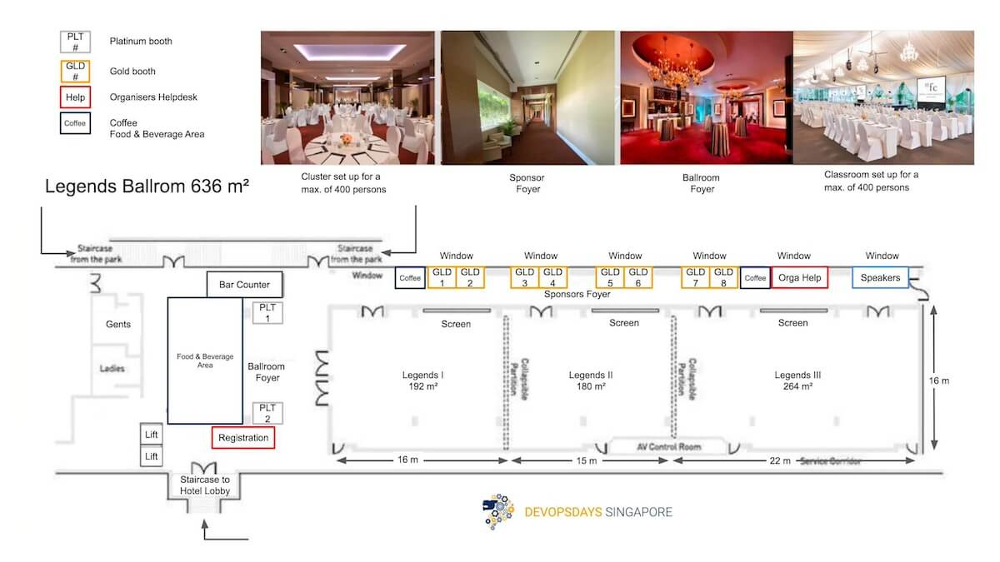

+++
title = "Sponsor Information"
type = "event"
description = "Sponsor information for DevOpsDays Singapore 2024!"
+++
Thank you for sponsoring DevOpsDays Singapore 2024! The organizing committee is excited and happy to welcome you as sponsors. This event could not exist without your support.

- [Sponsor Information](#sponsor-information)
	- [Important Dates](#important-dates)
	- [Registration](#registration)
	- [Code of Conduct](#code-of-conduct)
	- [Social Media](#social-media)
	- [Location](#location)
- [Sponsor Logistics](#sponsor-logistics)
	- [Floor Plan](#floor-plan)
	- [AV Rentals](#av-rentals)
	- [Internet](#internet)
	- [Sponsor Tables](#sponsor-tables)
	- [Sponsor Stamps](#sponsor-stamps)
	- [Sponsor Pitch Schedule](#sponsor-pitch-schedule)
- [Thursday Happy Hour](#happy-hour)
- [Friday Afternoon Raffle](#afternoon-raffle)
- [Other FAQs](#other-faqs)

# Sponsor Information

Please contact us at [] for all pre-event contact. One of the organizers will respond promptly.

## Important Dates

**March 13**: Last day to register for the event and get badge with name printed

**March 15**: Last day to order A/V equipment

**March 19**: Last day the venue will accept packages for the event

**March 20**: Pre-event setup, 2pm - 6pm

**March 21-22**: DevOpsDays Singapore 2024!

_Set-up starts at **7 AM**, registration at 8 am_

## Registration

All attendees, including sponsor exhibitors, are required to register for this event and wear the conference badge while in conference space. All sponsors should have received a coupon code after sponsorship is paid, that can be used to register your attendees. If you did not receive this code, please contact []

_Ticket Donation_: please notify the conference organizers if you will not be using all of your allotted tickets. We will **donate unused tickets** to underrepresented and marginalized groups in technology.

## Code of Conduct

Respect and empathy are core DevOps values. All sponsors and attendees are required to abide by the [Code of Conduct](../conduct) listed on our website. If at any time a member of the organizing committee finds that any attendee (associated with a sponsor or not) has violated the Code of Conduct, the organizing committee has the sole discretion to take any appropriate action up to and including asking that attendee to leave without a refund.

Please ensure all marketing materials and swag are appropriate and in line with our [Code of Conduct](../conduct) Sponsors with handouts, prizes, or other swag that organizers find in violation of our Code of Conduct will be asked to remove those items immediately.

## Social Media

The conference Twitter hashtag will be #devopsdays. Please tweet, blog, and otherwise share what you learn with everyone who isn't able to attend but could benefit from your experience! 



Check out some talks from previous years on <a href="https://www.youtube.com/channel/UCvKd52G5RaLAWVugTdY4pBA"><i class="fa fa-youtube fa-lg"></i>&nbsp;YouTube</a> or 
 Network and follow our updates on <a href="https://www.linkedin.com/company/devopsdayssp" target="_blank"><i class="fa fa-linkedin fa-lg"></i>&nbsp;DevOpsDays Singapore Linkedin</a> and 
  Check our previous events <a href="https://www.instagram.com/devopsdayssg" target="_blank"><i class="fa fa-instagram fa-lg"></i>&nbsp;on DevOpsDays Instagram</a>

### Note to sponsors about social media

Please note that sponsors are responsible for collecting their own leads and contact information for participants. If a sponsor abuses the social media at the event to harvest contact information, the organizers have the right to ban the organization from future events.

## Location

<address>
<a href="../location">Hotel Fort Canning</a> 
11 Canning Walk, 
Singapore 178881 
</address>

# Sponsor Logistics 

Deliveries, Set-up and Procedures:

1. All delivery of goods for hotel functions, exhibitions and restaurants must go through the Loading Bay, as indicated on the map, vehicle access permit would have to be applied prior.
2. Do note that only vans and lorries are allowed access to loading docks, cars are not permitted.
3. Goods to be collected after functions or exhibitions must go through the Loading Bay and will be inspected by the hotel Security personnel before goods are allowed to be taken out of the hotel.
4. No one is allowed to discard any containers, packages or empty boxes in the hotel premises.
5. There should be no nailing or pasting on the walls, silk screens, wallpaper, etc.
6. Suppliers will be responsible for any damage caused to the hotel premises during delivery or the set-up of items
7. Hotel Fort Canning is not responsible for any loss or damage of goods delivered unless a specific written agreement is made with the Management.
8. If sponsor has applied for a storage room, please ensure that recipient from sponsor will be available to receive the packages. Please email at [] for more information.

__*Strictly no delivery of goods is allowed through the Lobby or Front Entrance of the conference.__

## Floor Plan

<a href="./media/sponsor-floor.jpg">
 
*Click on the floorplan for a larger version*

## Audio Video (A/V) Rentals

Rentals are from the event A/V provider, items are priced for the event:

Monitors:
| No. | Description | Unit Rate (SGD) |
| ------------------ | ------- | ------------: |
| #1 | 24” monitor with table stand | $275.00  |
| #2 | 42” TV with table stand      | $450.00  | 
| #3 | 42” TV with floor stand      | $600.00  | 
| #4 | 55” TV with table stand      | $650.00  |
| #5 | 55” TV with floor stand      | $800.00  | 
| #6 | 65” TV with table stand      | $850.00  |
| #7 | 65” TV with floor stand      | $1000.00 |  
| #8 | Apple iPad 9.7-inch Retina Display | $150 |  

## Internet

Sponsors will have access to the same free wireless access points as the attendees. No hardwire ethernet connections will be available. We strongly encourage local demos as we will be unable to guarantee speed or function. Login details will be given on the day of the conference.

## Sponsor Tables

- Total "booth" space will be an 250cm x 180cm area.
- Platinum sponsors will be provided two 180cm x 75cm tables with a blackor white tablecloth, four chairs, and a power strip access.
- Gold sponsors will be provided a 180cm x 75cm table with a black tablecloth, one chair, and a power strip access.
- Sponsors will be allowed into the venue at 2:00 pm to 6:00 pm on Wednesday, March 20.
- Sponsors will be allowed into the venue at 7:00 am on Thursday, March 21
- Doors open at 8:00am for attendees; talks start at 9:00am.
- Teardown must be complete by 4:45 pm on Friday, March 22.

| Sponsor            | Table # | Table Rank |
| ------------------ | ------- | ------------ |
| TBC Sponsor        | TBC     | TBC |

## Sponsor Stamps

Attendees will be given 1 game card upon Registration

For every visit to a booth area, a booth manager will sign off with a booth stamp

Upon Completion of game card, Attendees can submit them at Registration Counter in exchange for booth swag

## Sponsor Pitch Schedule

Please send us the pitch by March 15. Each Platinum Sponsor will have three minutes (max three slides) and each Gold Sponsor will have one minute (one slide to be displayed during the pitch) to address the main hall and the listening audience during scheduled blocks between talks. Please ensure that the content of your pitch adheres to the [Code of Conduct](../conduct/).

We will display your slide deck or your company logo on the main screen during your pitch.

For each Silver Sponsor, the M.C. will introduce sponsor representatives and deliver a sponsor-provided pitch up to 20 seconds (about 40 words), with sponsor slide.

| Day       | Time (5 min slot) | Sponsors                |
|-----------|-------------------|-------------------------|
| **Thursday** | 9:45 AM            | Platinum #1 (3min) |
| 		   |                    | Gold #1 (1min) |
|          | 1:30 PM            | Gold #3  |
|          |                    | Gold #5  |
|          |                    | Gold #7  |
| **Friday**   | 9:45 AM            | Platinum #2 (3min) |
| 		   |                    | Gold #2 (1min) |
|          | 1:30 PM            | Gold #4  |
|          |                    | Gold #6  |
|          |                    | Gold #8  |
| 		   | 5:15 PM            | Sponsor giveaways       |
  

# Thursday Happy Hour

The first evening will have a <a href="../location/#happy-hour">social hour</a> from 5:25 pm until 7:30 pm.
If you are planning to host a party or happy hour, etc after either day of the conference, please let us know the details! We will include this information in communications to attendees. Please send the details to []

# Friday Afternoon Raffle

At 5:15 pm on Friday we have time allotted for you to give away any raffle/prizes on stage in front of everyone! Please be lined up on the side of the stage starting at 5:00pm. To move things along please follow these guidelines:

* You should already have the names of your winner(s) selected before coming on stage. If the person must be present to win, please have a few alternate names to go through if they aren’t here!
* After announcing your winner(s), proceed to the other end of the stage where you can have a photo taken with your winner(s)

# Other FAQs

**When can we pick our booth spot?**

Booths are assigned accordingly to sponsor level, then prioritized by when payment was received.

**What is the booth set up? Can we bring 1m roll-up as our back wall?**

Booths are long tables ( 180cm x 75cm) with a black tablecloth and power strip and 2 chairs. We recommend bringing/shipping: signage, handouts, pop-up banners, giveaways, etc. Banners must fit behind your booth.

**How many scanners (and which type) do we get?**

We do not provide scanners. This is not your typical conference. The booth is a place to interact with people during breaks.

Sponsors​ ​benefit​​ ​most​ ​when​ ​they actively​ ​participate​.

You are responsible for collecting any information in person. Raffles with a business card draw work well. Just let us know and we will give time on Day 2 to announce raffle winners. We have seen that sponsors benefit the most when they bring engineers to the conference, attend talks, and actively participate in open space sessions with the other attendees.

**Who should staff the booth? What are expo hours?**

If your goal is recruiting, consider sending engineering managers. If you are a vendor, send your sales engineers as well as your technical product marketing, and even some engineers. DevOpsDays are about quality, not quantity - it's about active participation!

**Can we do a giveaway on stage?**

Yes. If you want to do a giveaway, you will need to collect your own information (e.g. business cards, entry slips, etc.) for whatever drawing mechanism you want to use. After the ignites on the second day, we will give you a short time slot on stage for your giveaway activity. Just let us know.

**Who organizes DevOpsDays Singapore?**

Your [DevOpsDays Singapore organizers](../contact) are Singapore-based technology folks who volunteer their time for this event.

For any other questions, email at []