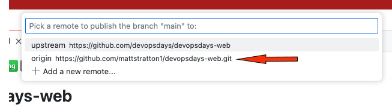

# Using GitHub Codespaces with devopsdays-web

*This is a work in progress and the document may not be comprehensive. Pull requests welcome!*

GitHub Codespaces allows you to do all the editing and changes to your files on the devopsdays website without having to run hugo or anything locally! It even works with the utility scripts.

## Getting started

Begin by going to [github.com/devopsdays/devopsdays-web](github.com/devopsdays/devopsdays-web) and on the README, click the "Open in GitHub Codespaces" button:

This will take you to a screen to set up the Codespace:

Do not change the settings for Repository, Branch, Dec container configuration, or Machine type. You can select a Region that is closest to you. Click "Create Codespace".

This will take a few minutes to set up. Once it is ready, you will see a screen like this:

You may see a message at the bottom like this:

If you click on the "Open in browser" link, you will see the site in your browser.

If you do not see this message, you can always find the URL for the site in the "ports" section:

*Click on the link to see options for opening the site in a browser.*

## Running commands

If you need to run any terminal commands (i.e., one of the utility scripts), you can open a terminal by clicking on the "Terminal" tab and then selecting the "bash" tab:

## Committing changes

When you have made any changes you need, you will want to commit them to git and push them to your fork. 

You can do this by clicking on the "Source Control" tab on the left-hand side of the screen. 

*The Source Control tab is the third from the top. If there are uncommitted changes, it will identify this with a badge, like this one that shows "11"*

This will show you all the files that have been changed. You can stage the files you want to commit by clicking on the "+" next to the file name. Then you can enter a commit message and click the green "Commit" button to commit the changes.

Now you can just push "Publish branch" to push the changes to your fork.

Make sure you push to your fork and not the main repository!

Now you can create a pull request to merge your changes into the main repository, the same way you would with any other method.

## Stopping your codespace

When you are not using your Codespace, you want to be sure to stop it, so you are not using up your hours. See [Stopping and starting a codespace](https://docs.github.com/en/codespaces/developing-in-a-codespace/stopping-and-starting-a-codespace) for more methods to do this.

## A note on "billing"

Free, personal GitHub accounts have 120 core-hours per month of Codespaces usage.

In order to build the devopsdays-web site, you will need a "machine type" of 4 cores and 16 GB of RAM. So this means you can use the Codespace for 30 hours per month. If you are using the Codespace for other projects, you will need to be mindful of your usage.

If you'd like to see how much of your allocated core-hours you have used, visit your [GitHub Billing Summary](https://github.com/settings/billing/summary)
