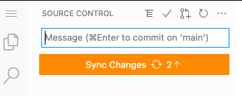
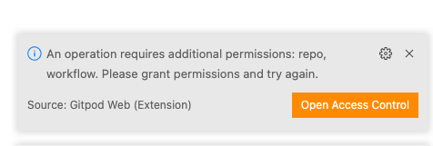
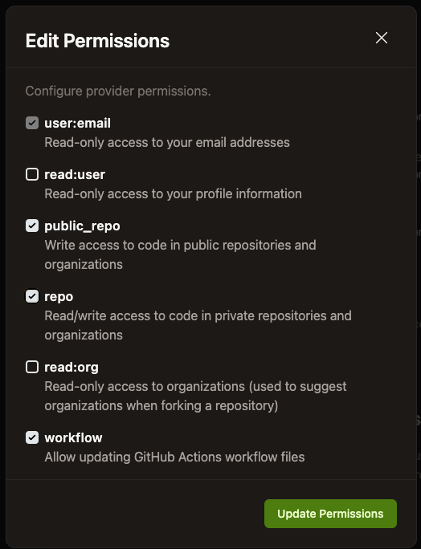

# Using Gitpod with devopsdays-web

*This is a work in progress and the document may not be comprehensive. Pull requests welcome!*

Gitpod allows you to do all the editing and changes to your files on the devopsdays website without having to run hugo or anything locally! It even (probably) works with the utility scripts.

## getting started

Begin by going to [github.com/devopsdays/devopsdays-web](github.com/devopsdays/devopsdays-web) and on the README, click the "Open in Gitpod" button:

