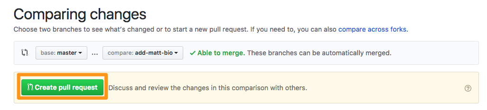
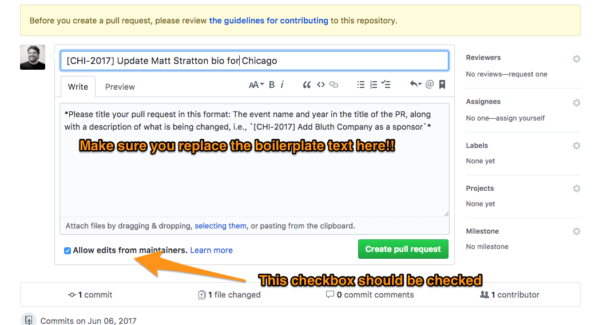
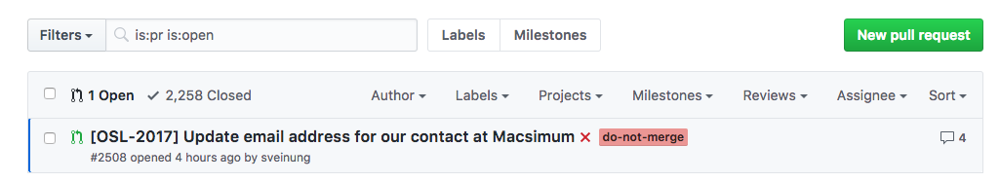
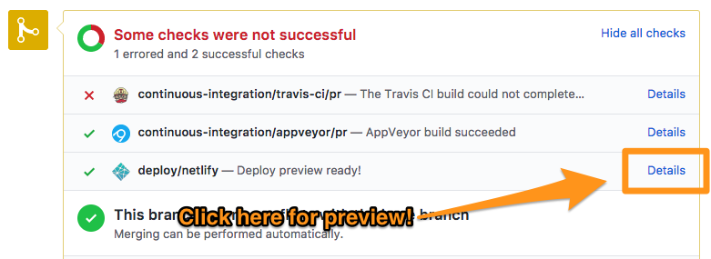
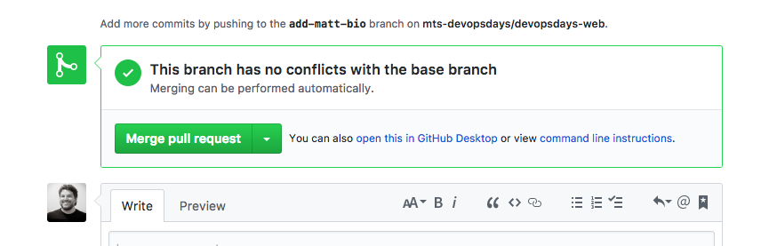
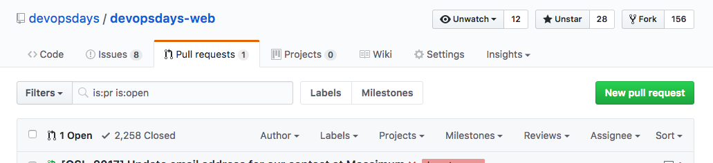
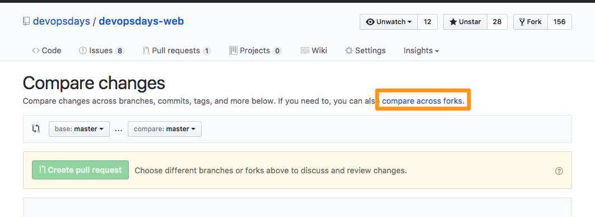
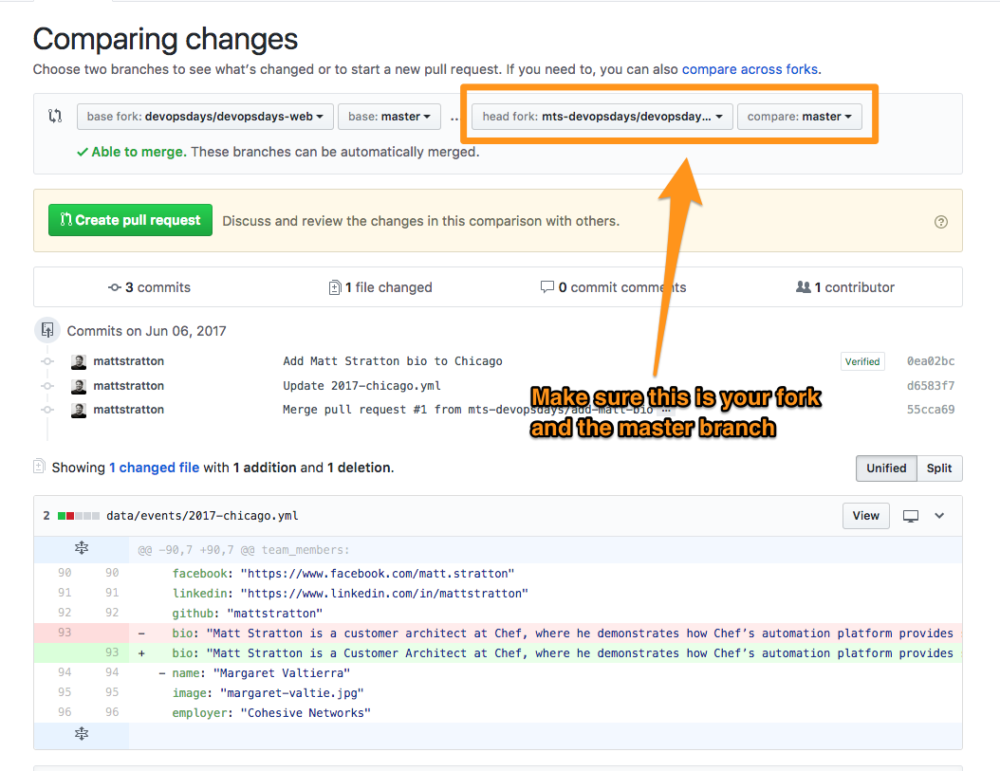

# Working with your own repository

# Table of contents
<!-- MDTOC maxdepth:6 firsth1:1 numbering:0 flatten:0 bullets:1 updateOnSave:1 -->

- [Working with your own repository](#working-with-your-own-repository)   
- [Table of contents](#table-of-contents)   
   - [Organization Setup](#organization-setup)   
   - [Fork the devopsdays-web repo](#fork-the-devopsdays-web-repo)   
   - [Setting up your local systems](#setting-up-your-local-systems)   
      - [Clone your organization's repository](#clone-your-organizations-repository)   
   - [Setting up Netlify](#setting-up-netlify)   
      - [Creating a Netlify Account](#creating-a-netlify-account)   
      - [Setting Up Your Site With Netlify](#setting-up-your-site-with-netlify)   
         - [Change the name of your Site](#change-the-name-of-your-site)   
         - [Change to open source plan](#change-to-open-source-plan)   
   - [Working Locally](#working-locally)   
      - [Saving and uploading your work](#saving-and-uploading-your-work)   
   - [Working With Pull Requests](#working-with-pull-requests)   
   - [Reviewing Pull Requests](#reviewing-pull-requests)   
   - [Submitting a pull request to origin](#submitting-a-pull-request-to-origin)   

<!-- /MDTOC -->


It's super helpful to run your own, event-level, GitHub project for `devopsdays-web` to make changes there, and then push the pull request up to the main repo.

We suggest that you follow the same process that we do for the main repo, which would be as follows:

1. Make your changes in a branch. Push that branch up to your repo.
2. Submit a pull request in your own repo against your own master. Make sure that the deploy previews look good!
3. If everything looks good to you, merge them into your own master just to make sure that the full build works (there are steps that occur in a build to master that do not occur in a branch deploy)
4. If everything still looks awesome, submit a PR from your `master` branch to `devopsdays/devopsdays-web`.

## Organization Setup
First, you'll want to set up an organization for your devopsdays event. Go to github.com and under your name, scroll down and click on "Create Organization":


Fill out the form, choosing the free plan. Give the organization a good name that makes sense.


Finally, add team members to your organization. You do not need to do this right away.


## Fork the devopsdays-web repo

Go to the [devopsdays/devopsdays-web](https://github.com/devopsdays/devopsdays-web) repository, and click on the "Fork" button in the upper right:


Make sure you choose your new organization as the location to fork it to, not to your own GitHub account:


You should end up with a fork that looks a little like this:


## Setting up your local systems

### Clone your organization's repository

Click on the "Clone or Download" button on your repo. Copy the full URL listed there (if you prefer to use ssh, use that link, but choosing HTTPS over SSH is beyond the scope of this document).


At the command line, wherever you want to keep your code, enter the following (inserting the URL you copied instead of $URL):

```
git clone $URL
```

You will see output similar to this:

```
 ~/src/github.com/mts-devopsdays/ git clone git@github.com:mts-devopsdays/devopsdays-web.git
Cloning into 'devopsdays-web'...
Kryptonite ▶ Requesting SSH authentication from phone
Kryptonite ▶ Success. Request Allowed ✔
remote: Counting objects: 55836, done.
remote: Compressing objects: 100% (147/147), done.
remote: Total 55836 (delta 55), reused 1 (delta 1), pack-reused 55686
Receiving objects: 100% (55836/55836), 148.63 MiB | 4.45 MiB/s, done.
Resolving deltas: 100% (30321/30321), done.
 ~/src/github.com/mts-devopsdays/
```

Now, change directories into the new `devopsdays-web` directory you created. You will want to create an additional remote to the `devopsdays-web` upstream. Use one of these commands (depending on if you prefer HTTPS or SSH)

```
git remote add upstream git@github.com:devopsdays/devopsdays-web.git
```
or
```
git remote add upstream https://github.com/devopsdays/devopsdays-web.git
```

If you enter the command `git remote -v` you will see all your remotes:
```
 ~/src/github.com/mts-devopsdays/devopsdays-web/ [master] git remote -v
origin	git@github.com:mts-devopsdays/devopsdays-web.git (fetch)
origin	git@github.com:mts-devopsdays/devopsdays-web.git (push)
upstream	git@github.com:devopsdays/devopsdays-web.git (fetch)
upstream	git@github.com:devopsdays/devopsdays-web.git (push)
```

This is useful because you will want, at some point, to be able to merge down changes from the upstream, which is `devopsdays/devopsdays-web`.

## Setting up Netlify

Using Netlify will allow for a function called "deploy previews", which allows any changes you make to a branch in your repository (if they have a pull request) to be viewed live, in a browser. Netlify is free for open-source projects, so as long as you haven't made your repository private, it shouldn't cost anything.

### Creating a Netlify Account

Log onto [https://www.netlify.com](https://www.netlify.com) and click on the "Sign Up" button:


Choose to log in with GitHub. Use the same account you've been using (since it needs permissions to your repositories).

You may be prompted to enter your GitHub credentials:


You will then be prompted to authorize Netlify to have access to your GitHub account:


### Setting Up Your Site With Netlify

Choose to set up a new site from Git:


Select GitHub as the provider:


Finally, select the repository you wish to use. This is the fork of `devopsdays-web` you created earlier:


You will be prompted for some build commands. Enter them as follows:


(Note. The build command is `hugo_0.19 --theme=devopsdays-theme --buildDrafts=false`; don't worry about the hugo version as this is handled in a settings file already in your repository)

Finish up by clicking on "Deploy Site". We aren't done, but this takes us to the next steps.

#### Change the name of your Site

This is optional, but will make it much easier to track and remember. Click on "Settings", and then change the site name as indicated:


#### Change to open source plan

Also an optional step, but it's advised to perform it if your repository is not protected:


## Working Locally

When you are ready to make some changes, the first thing to do is make sure you are in the local directory where you cloned down the fork. Before starting any new change, it is essential that you `rebase` your local repository from the upstream. Issue thee commands:

 - `git checkout master`
 - `git pull upstream master --rebase`


 This confirms you are on the master branch locally, and then applies the changes from the upstream to your copy.

 The next step is to create a new branch for the changes you are going to make. Use the command `git checkout -b my-new-branch` (where "my-new-branch" is a recognizeable name for the set of changes, such as `add-matt-bio`). This switches you to a new branch for you to do your work.

### Saving and uploading your work

 After you have saved your work, you will need to add it to the staging area with git. You can either do this one file at a time (`git add data/events/2017-chicago.yml`) or add all changed files with `git add .` To see the list of files changed, type in `git status`

 ```
  ~/src/github.com/mts-devopsdays/devopsdays-web/ [add-matt-bio*] git status
On branch add-matt-bio
Changes not staged for commit:
  (use "git add <file>..." to update what will be committed)
  (use "git checkout -- <file>..." to discard changes in working directory)

        modified:   data/events/2017-chicago.yml

no changes added to commit (use "git add" and/or "git commit -a")
```

Now that we have staged the files, we need to commit them. Use the command `git commit` with the `-m` flag to add a useful message. The workflow looks something like this:

```
 ~/src/github.com/mts-devopsdays/devopsdays-web/ [add-matt-bio*] git add .
 ~/src/github.com/mts-devopsdays/devopsdays-web/ [add-matt-bio+] git status
On branch add-matt-bio
Changes to be committed:
  (use "git reset HEAD <file>..." to unstage)

        modified:   data/events/2017-chicago.yml

 ~/src/github.com/mts-devopsdays/devopsdays-web/ [add-matt-bio+] git commit -m "Add Matt Stratton bio to Chicago"
[add-matt-bio 0ea02bc2] Add Matt Stratton bio to Chicago
 1 file changed, 1 insertion(+), 1 deletion(-)
 ~/src/github.com/mts-devopsdays/devopsdays-web/ [add-matt-bio] git status
On branch add-matt-bio
nothing to commit, working tree clean
```

You now need to push up your branch to your own origin (your fork). Do this with the command `git push origin name-of-your-branch`, i.e.

```
 ~/src/github.com/mts-devopsdays/devopsdays-web/ [add-matt-bio] git push origin add-matt-bio
Counting objects: 1131, done.
Delta compression using up to 4 threads.
Compressing objects: 100% (542/542), done.
Writing objects: 100% (1131/1131), 13.56 MiB | 2.73 MiB/s, done.
Total 1131 (delta 685), reused 995 (delta 568)
remote: Resolving deltas: 100% (685/685), completed with 151 local objects.
To github.com:mts-devopsdays/devopsdays-web.git
 * [new branch]        add-matt-bio -> add-matt-bio
 ```

## Working With Pull Requests

Now that you have pushed up your branch to your fork, you need to submit it as a pull request to your own `master` branch on your fork. This allows your other teammates to approve/view the changes you have proposed.

Open the URL of your fork in a browser (make sure you are logged into GitHub). You should see something like this:


 Make sure you have changed the base fork to your own `master` branch. It should look like this.



Now you can review the pull request, and add any comments that make sense.



## Reviewing Pull Requests

You can easily see the status and discussion on a PR by clicking on its name in the list of Pull Requests:



If you see a passed indicator for Netlify, click on "Details" to see the preview of the site with your changes.



## Submitting a pull request to origin

Once you are satisfied with the pull request, click the "Merge pull request" button, and you are good to go.



Now, visit https://github.com/devopsdays/devopsdays-web/pulls and click on "New pull requests"



Click "compare across forks"





When filling out the pull request form, make sure that you follow the guidelines in the template - including replacing the template text itself! Also, if you tick the "Allow edits from maintainers" box, that will help the maintainers directly fix any issues with your PR.


That's it! Now you can either view the proposed merge via Netlify (using a similar technique as before), or wait for your change to be merged. Be advised that maintainers may have questions about your PR, so watch for the conversation thread.
