# Working with your own repository

# Table of contents
<!-- MDTOC maxdepth:6 firsth1:1 numbering:0 flatten:0 bullets:1 updateOnSave:1 -->

- [Working with your own repository](#working-with-your-own-repository)   
- [Table of contents](#table-of-contents)   
   - [Organization Setup](#organization-setup)   
   - [Fork the devopsdays-web repo](#fork-the-devopsdays-web-repo)   
   - [Setting up your local systems](#setting-up-your-local-systems)   
      - [Clone your organization's repository](#clone-your-organizations-repository)   
   - [Setting up Netlify](#setting-up-netlify)   
      - [Creating a Netlify Account](#creating-a-netlify-account)   
      - [Setting Up Your Site With Netlify](#setting-up-your-site-with-netlify)   
         - [Change the name of your Site](#change-the-name-of-your-site)   
         - [Change to open source plan](#change-to-open-source-plan)   

<!-- /MDTOC -->


It's super helpful to run your own, event-level, GitHub project for `devopsdays-web` to make changes there, and then push the pull request up to the main repo.

We suggest that you follow the same process that we do for the main repo, which would be as follows:

1. Make your changes in a branch. Push that branch up to your repo.
2. Submit a pull request in your own repo against your own master. Make sure that the deploy previews look good!
3. If everything looks good to you, merge them into your own master just to make sure that the full build works (there are steps that occur in a build to master that do not occur in a branch deploy)
4. If everything still looks awesome, submit a PR from your `master` branch to `devopsdays/devopsdays-web`.

## Organization Setup
First, you'll want to set up an organization for your devopsdays event. Go to github.com and under your name, scroll down and click on "Create Organization":

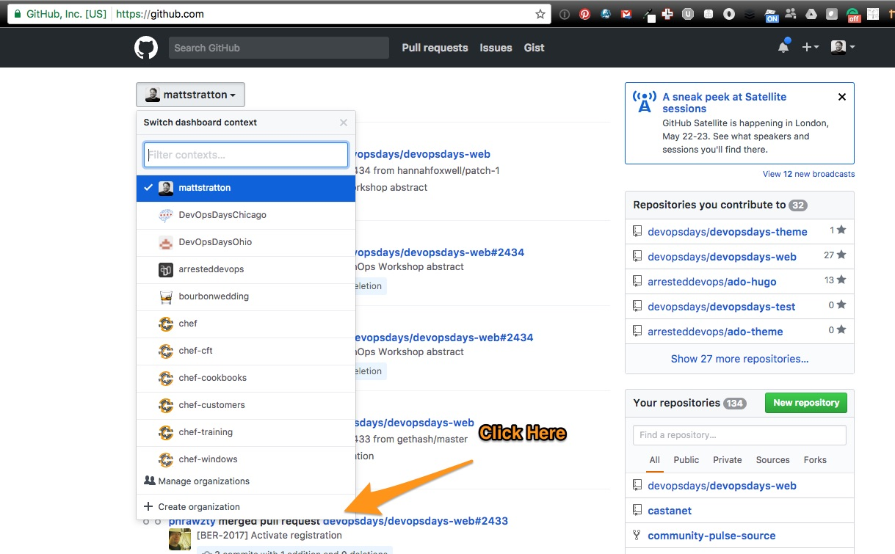

Fill out the form, choosing the free plan. Give the organization a good name that makes sense.

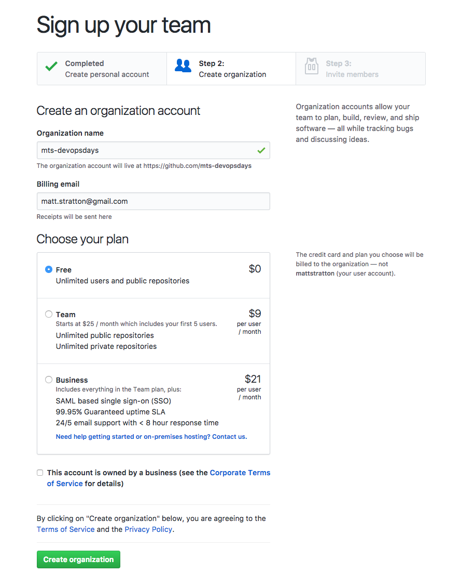

Finally, add team members to your organization. You do not need to do this right away.

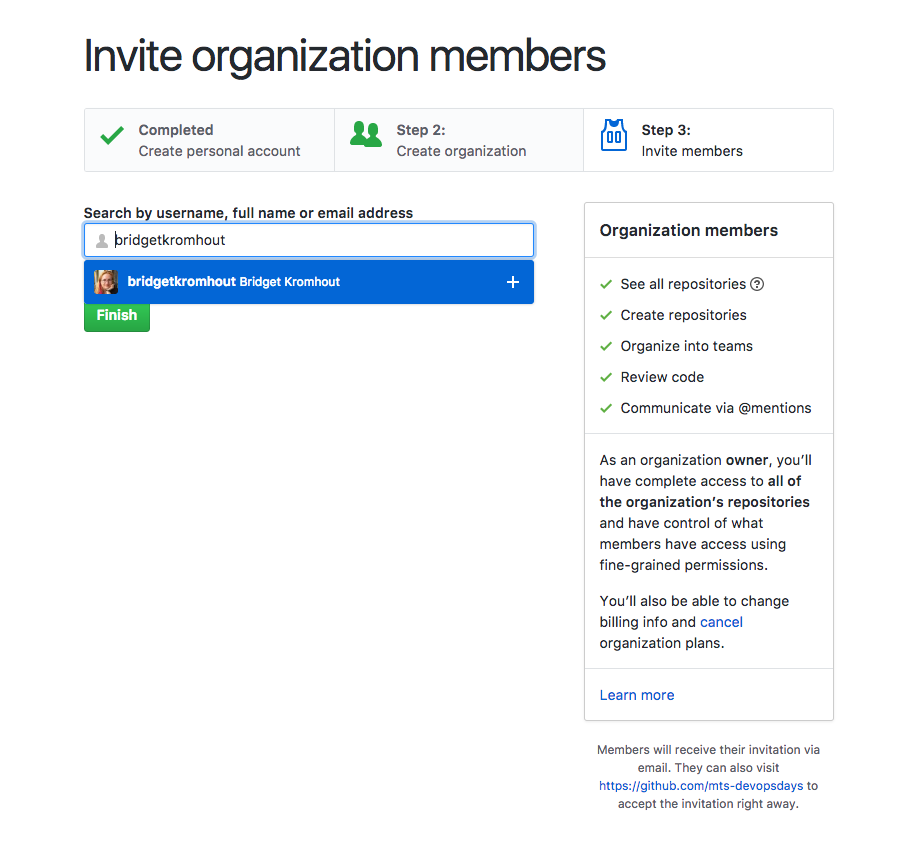

## Fork the devopsdays-web repo

Go to the [devopsdays/devopsdays-web](https://github.com/devopsdays/devopsdays-web) repository, and click on the "Fork" button in the upper right:

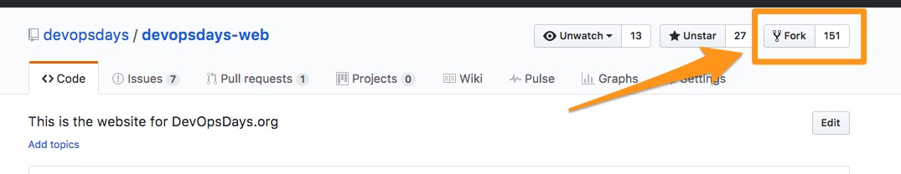

Make sure you choose your new organization as the location to fork it to, not to your own GitHub account:

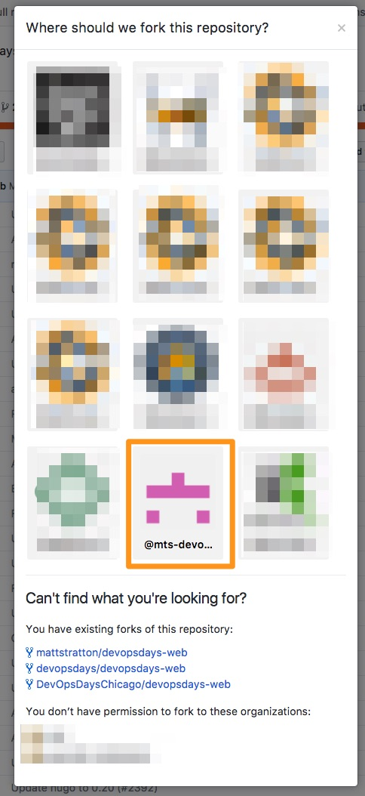

You should end up with a fork that looks a little like this:

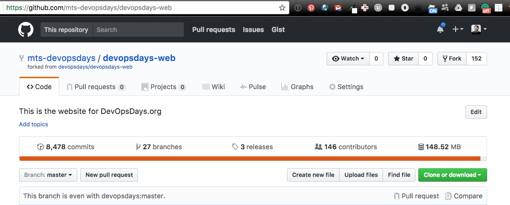

## Setting up your local systems

### Clone your organization's repository

Click on the "Clone or Download" button on your repo. Copy the full URL listed there (if you prefer to use ssh, use that link, but choosing HTTPS over SSH is beyond the scope of this document).

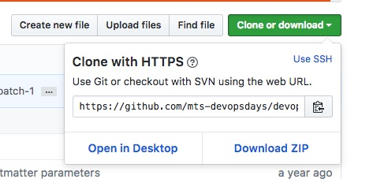

At the command line, wherever you want to keep your code, enter the following (inserting the URL you copied instead of $URL):

```
git clone $URL
```

You will see output similar to this:

```
 ~/src/github.com/mts-devopsdays/ git clone git@github.com:mts-devopsdays/devopsdays-web.git
Cloning into 'devopsdays-web'...
Kryptonite ▶ Requesting SSH authentication from phone
Kryptonite ▶ Success. Request Allowed ✔
remote: Counting objects: 55836, done.
remote: Compressing objects: 100% (147/147), done.
remote: Total 55836 (delta 55), reused 1 (delta 1), pack-reused 55686
Receiving objects: 100% (55836/55836), 148.63 MiB | 4.45 MiB/s, done.
Resolving deltas: 100% (30321/30321), done.
 ~/src/github.com/mts-devopsdays/
```

Now, change directories into the new `devopsdays-web` directory you created. You will want to create an additional remote to the `devopsdays-web` upstream. Use one of these commands (depending on if you prefer HTTPS or SSH)

```
git remote add upstream git@github.com:devopsdays/devopsdays-web.git
```
or
```
git remote add upstream https://github.com/devopsdays/devopsdays-web.git
```

If you enter the command `git remote -v` you will see all your remotes:
```
 ~/src/github.com/mts-devopsdays/devopsdays-web/ [master] git remote -v
origin	git@github.com:mts-devopsdays/devopsdays-web.git (fetch)
origin	git@github.com:mts-devopsdays/devopsdays-web.git (push)
upstream	git@github.com:devopsdays/devopsdays-web.git (fetch)
upstream	git@github.com:devopsdays/devopsdays-web.git (push)
```

This is useful because you will want, at some point, to be able to merge down changes from the upstream, which is `devopsdays/devopsdays-web`.

## Setting up Netlify

Using Netlify will allow for a function called "deploy previews", which allows any changes you make to a branch in your repository (if they have a pull request) to be viewed live, in a browser. Netlify is free for open-source projects, so as long as you haven't made your repository private, it shouldn't cost anything.

### Creating a Netlify Account

Log onto [https://www.netlify.com](https://www.netlify.com) and click on the "Sign Up" button:

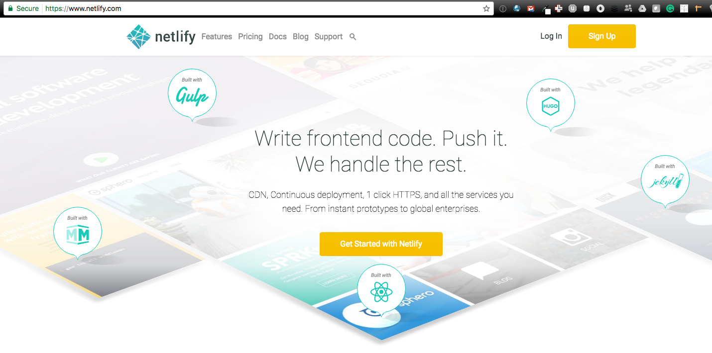

Choose to log in with GitHub. Use the same account you've been using (since it needs permissions to your repositories).

You may be prompted to enter your GitHub credentials:

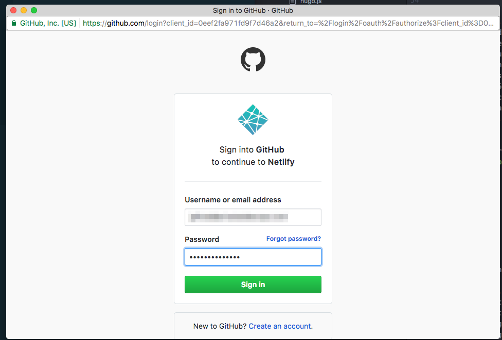

You will then be prompted to authorize Netlify to have access to your GitHub account:

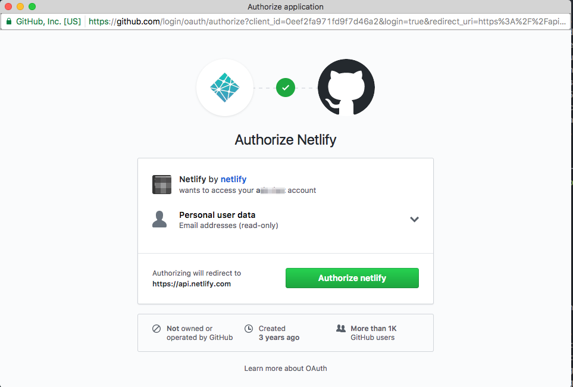

### Setting Up Your Site With Netlify

Choose to set up a new site from Git:

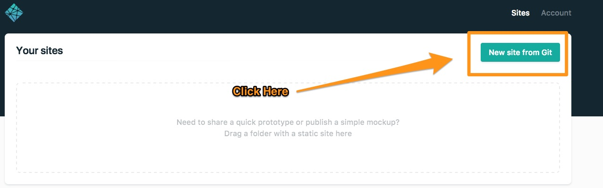

Select GitHub as the provider:

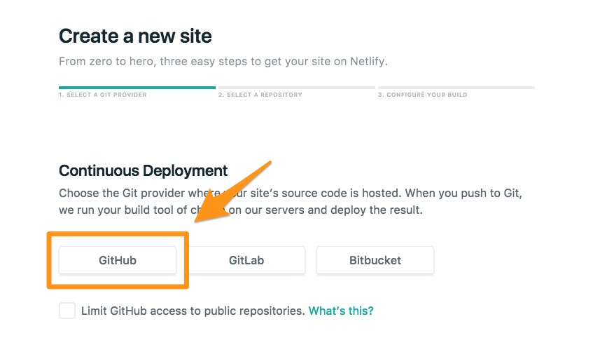

Finally, select the repository you wish to use. This is the fork of `devopsdays-web` you created earlier:

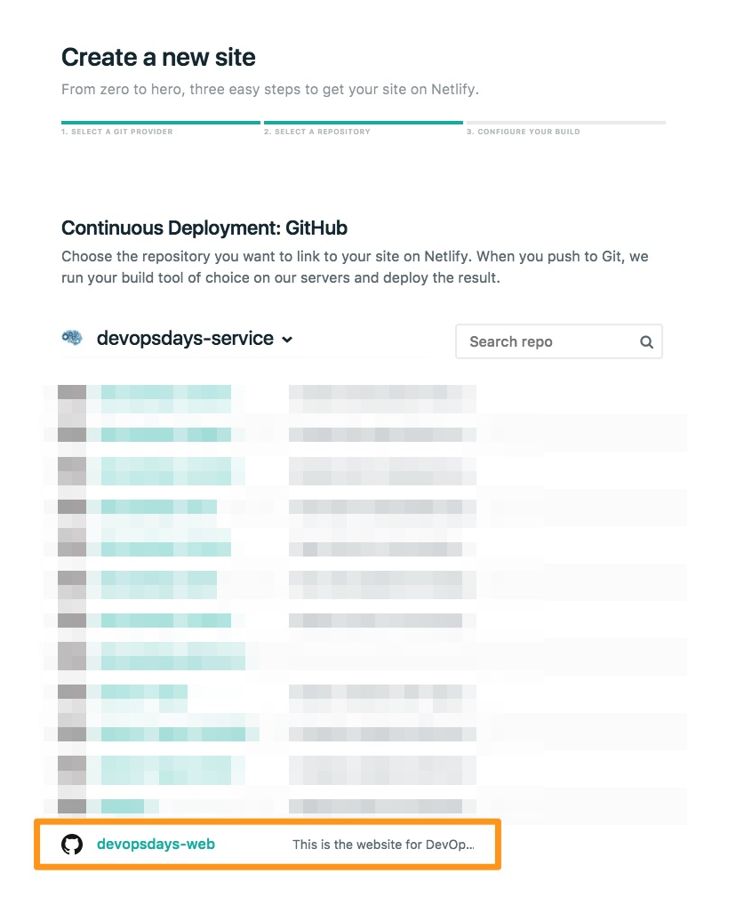

You will be prompted for some build commands. Enter them as follows:

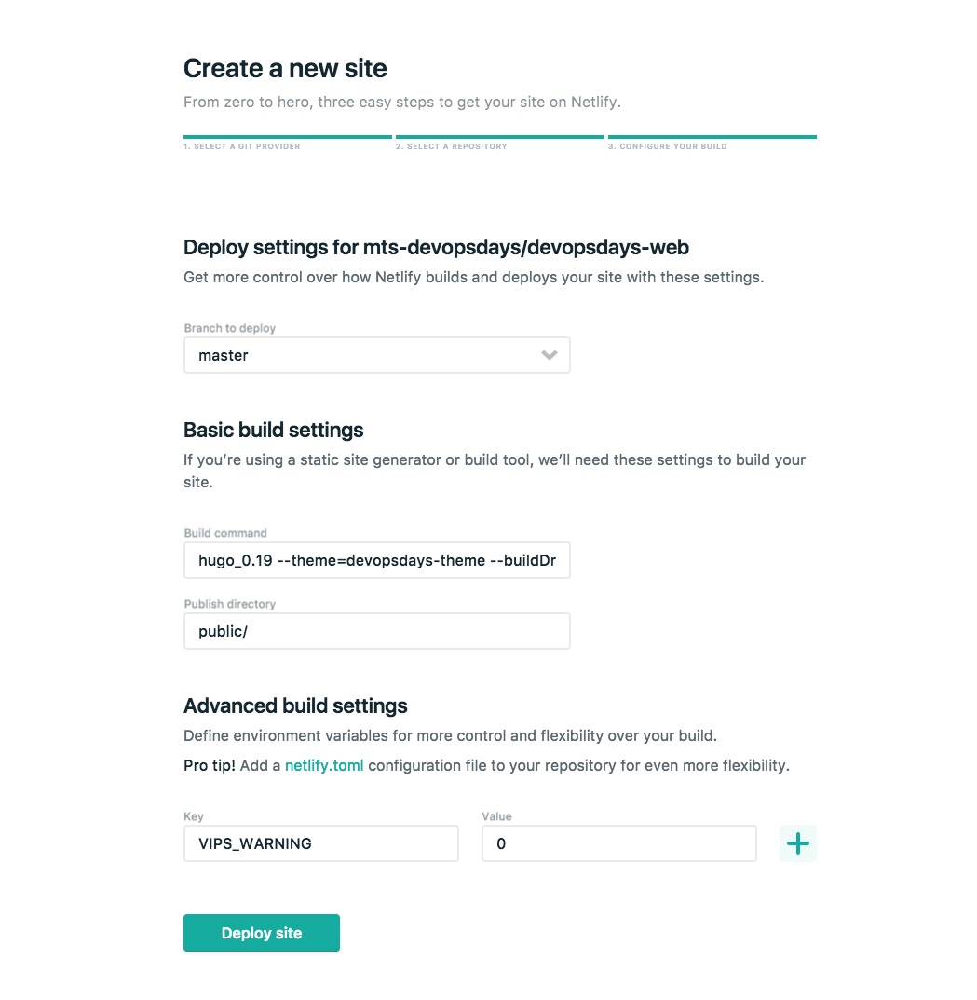

(Note. The build command is `hugo_0.19 --theme=devopsdays-theme --buildDrafts=false`; don't worry about the hugo version as this is handled in a settings file already in your repository)

Finish up by clicking on "Deploy Site". We aren't done, but this takes us to the next steps.

#### Change the name of your Site

This is optional, but will make it much easier to track and remember. Click on "Settings", and then change the site name as indicated:

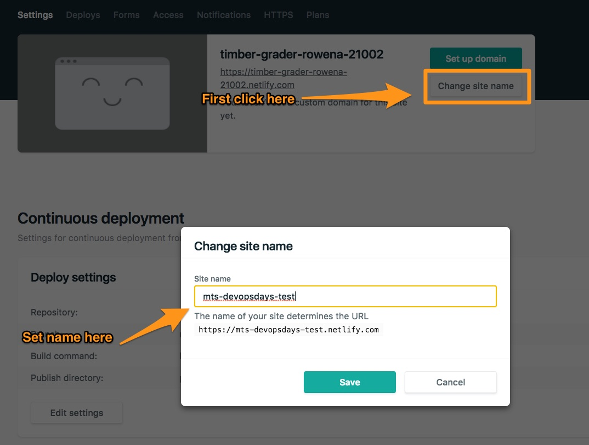

#### Change to open source plan

Also an optional step, but it's advised to perform it if your repository is not protected:

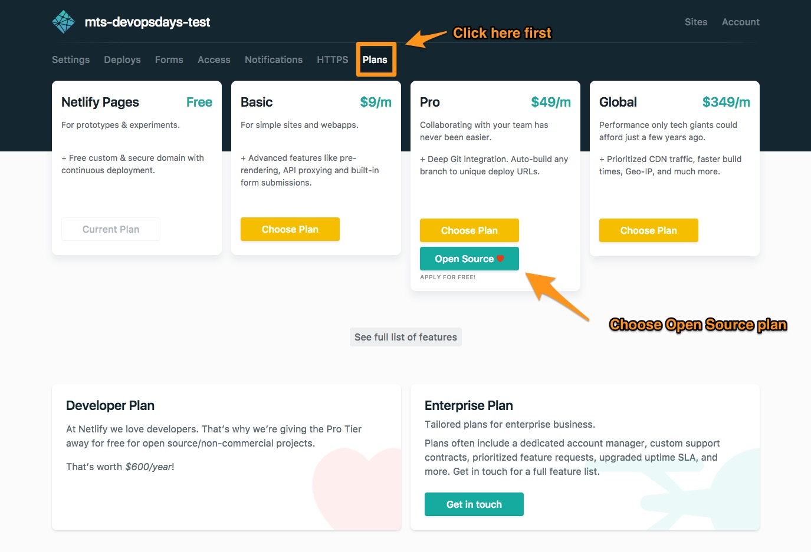
